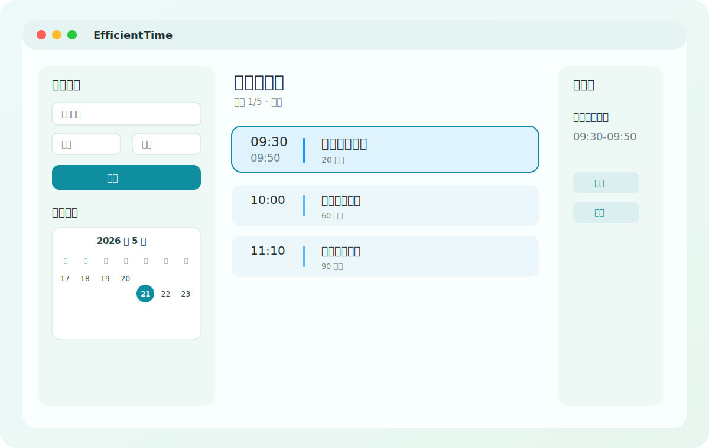
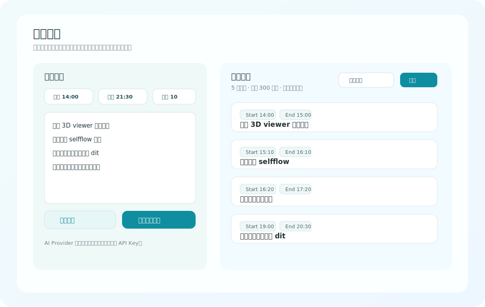
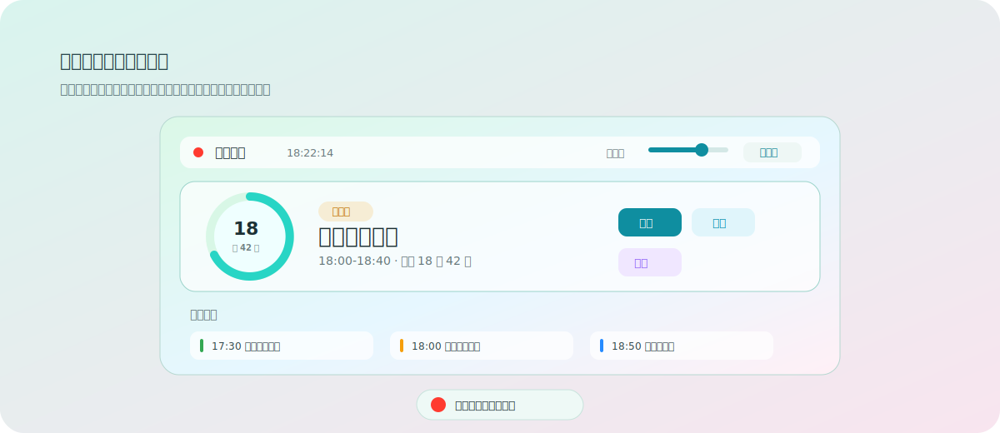

# EfficientTime

中文 | [English](README.md)

EfficientTime 是一个支持 AI 规划的本地单机 macOS 高效办公助手。它可以把零散的任务文字整理成可执行的每日时间表，并通过菜单栏、桌面悬浮窗和系统通知持续提醒你现在应该做什么、接下来做什么、哪些事项已经完成。

当前版本：`0.01`

## 核心用途

- 把一天的工作拆成清晰的时间块。
- 用桌面常驻悬浮窗实时显示当前任务、剩余时间和附近任务。
- 悬浮窗会在应用运行时常驻桌面并保持可见，需要减少占用时可以折叠/缩小。
- 在任务开始、结束等关键时间主动提醒。
- 支持快速手动添加任务，也支持 AI 把原始计划文本整理成可编辑的日程草稿。
- 本地保存计划和设置，不依赖账户或云同步。

EfficientTime 的定位不是通用 Todo、团队协作或完整日历替代品，而是一个专注于“今天怎么执行”的本地执行面板。

## 截图示例

### 今日计划



### 智能规划



### 桌面悬浮窗



## 简单用法

1. 打开 EfficientTime。
2. 在 `计划` 页选择日期。
3. 用 `快速添加` 输入任务名称、开始时间和结束时间。
4. 点击 `开始执行`，让应用进入执行状态。
5. 通过悬浮窗查看当前任务、倒计时和附近任务。
6. 在任务行或悬浮窗里标记完成、跳过或推迟。
7. 在 `智能规划` 页粘贴一段原始计划，让 AI 生成可编辑日程草稿，再应用到指定日期。

## AI 规划

AI 规划是辅助功能，默认不会直接覆盖正式计划。

基本流程：

```text
原始计划文本 -> AI 生成草稿 -> 本地校验/整理 -> 用户确认应用 -> 日程时间表
```

目前支持：

- DeepSeek
- 火山方舟

API Key 只在 `设置` 页配置，保存在本机本地配置中，不应提交到仓库。

## 本地开发

要求：

- macOS 15 或更新版本
- Swift 6

运行测试：

```bash
swift test
```

本地构建：

```bash
swift build
```

开发运行：

```bash
./scripts/run_app.sh
```

## 打包

生成本地 `.app`：

```bash
./scripts/build_app_bundle.sh
open dist/EfficientTime.app
```

生成 GitHub Release 可上传的 `.dmg` 和 zip：

```bash
./scripts/package_release.sh 0.01
```

输出文件：

```text
dist/EfficientTime-0.01.dmg
dist/EfficientTime-0.01-macOS.zip
```

Release 推荐上传 `.dmg`，zip 可作为备用下载。当前包是本地开发包，尚未进行 Developer ID 签名和 Apple 公证。

## 项目结构

```text
Sources/EfficientTimeCore
  Domain/       领域模型
  Scheduling/   本地排程和校验
  AI/           AI 规划接口和上下文裁剪

Sources/EfficientTimeApp
  App/          应用状态
  Views/        主窗口 SwiftUI 视图
  MenuBar/      菜单栏入口
  FloatingPanel/桌面悬浮窗
  Notifications/系统通知
  Persistence/ 本地持久化和密钥存储
```

## 构建方式与致谢

EfficientTime 是一个 vibe coding 项目，主要基于 OpenAI Codex 完成产品设计、SwiftUI 实现、交互迭代、文档整理和发布打包。

感谢 Codex 帮助把最初的产品想法落成一个可以运行的本地 macOS 应用。

## 发布状态

`0.01` 是早期预览版，聚焦本地时间表执行、实时提醒、悬浮窗和 AI 草稿规划。后续可以继续补充签名、公证、安装包和更完善的交互细节。
